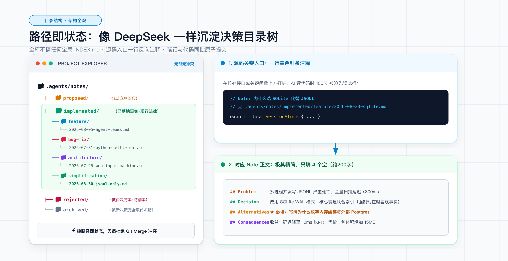
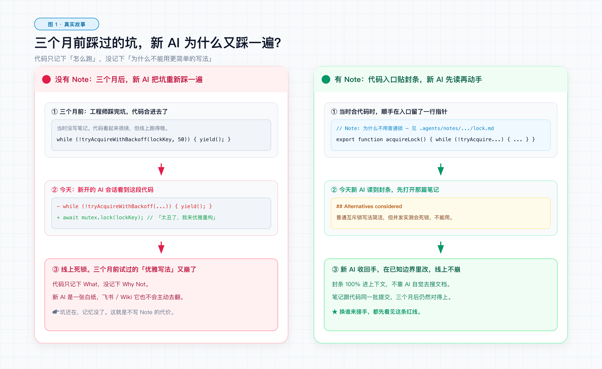
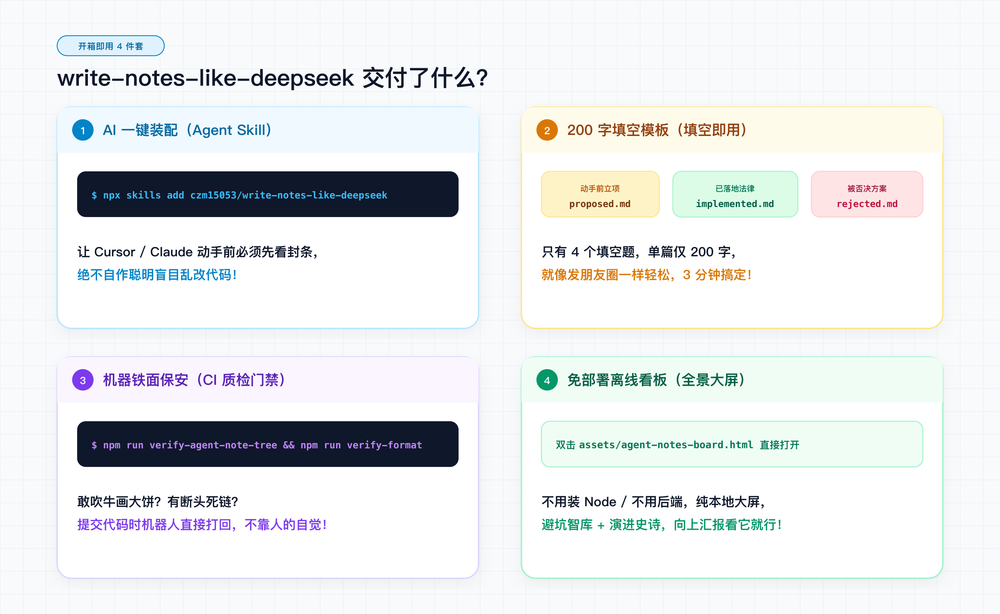
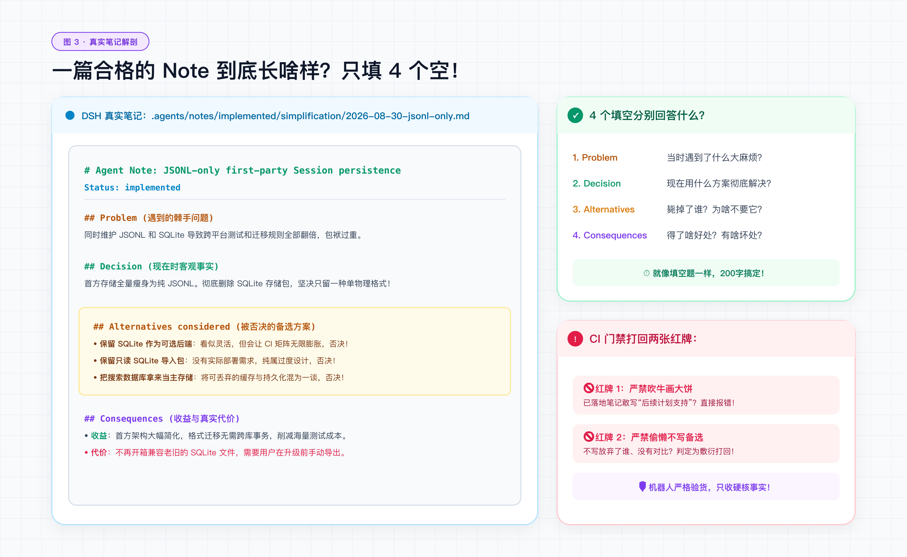
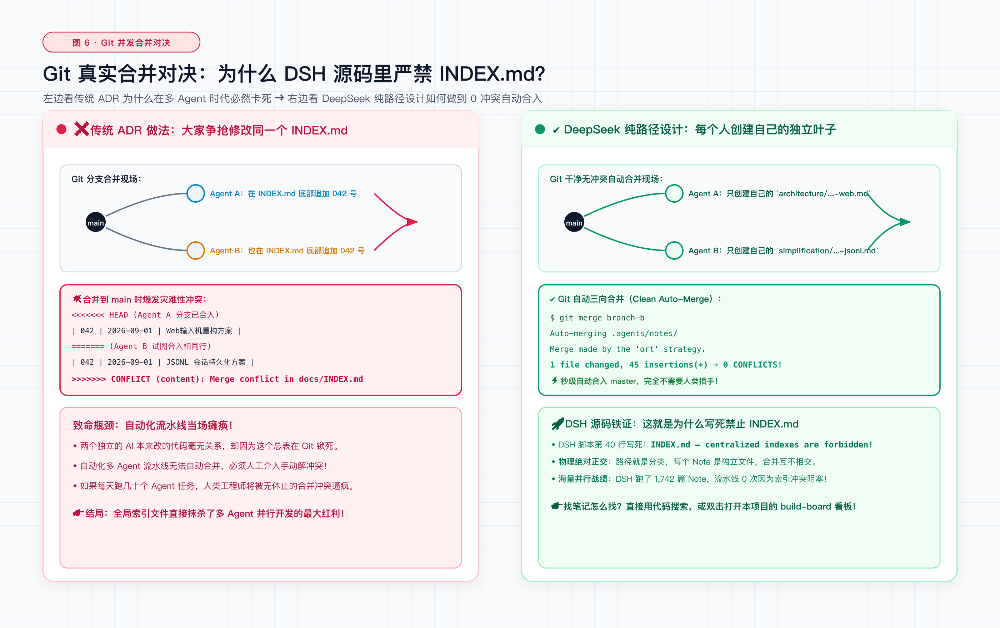
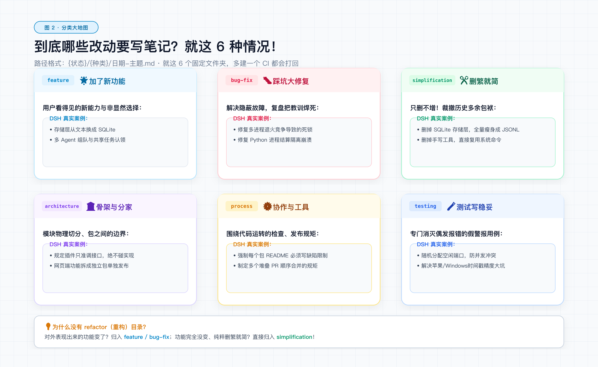
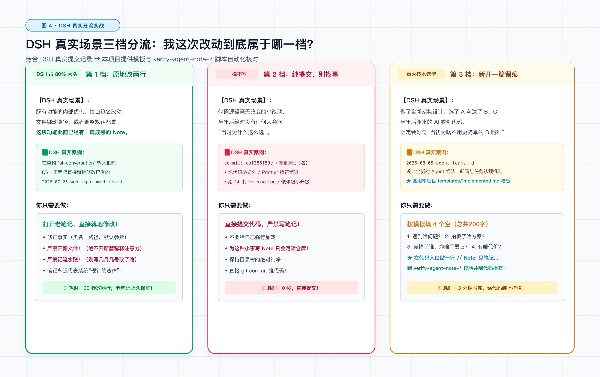
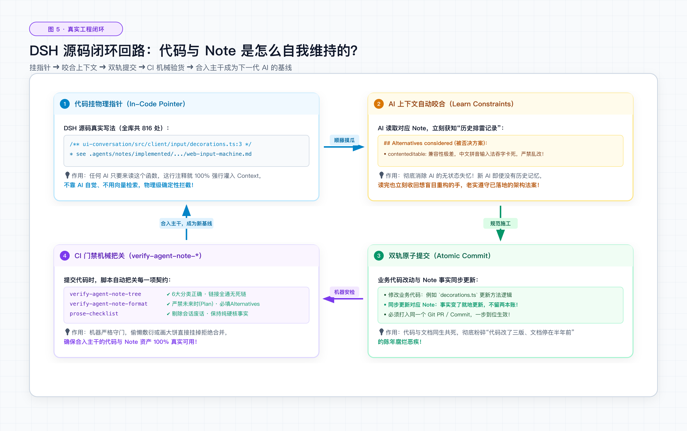
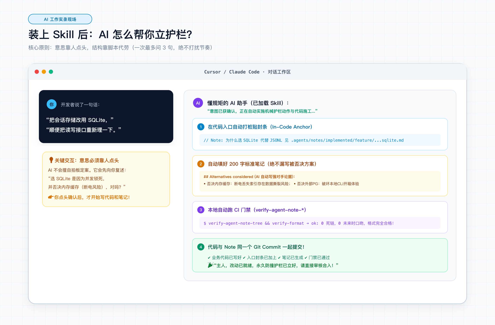
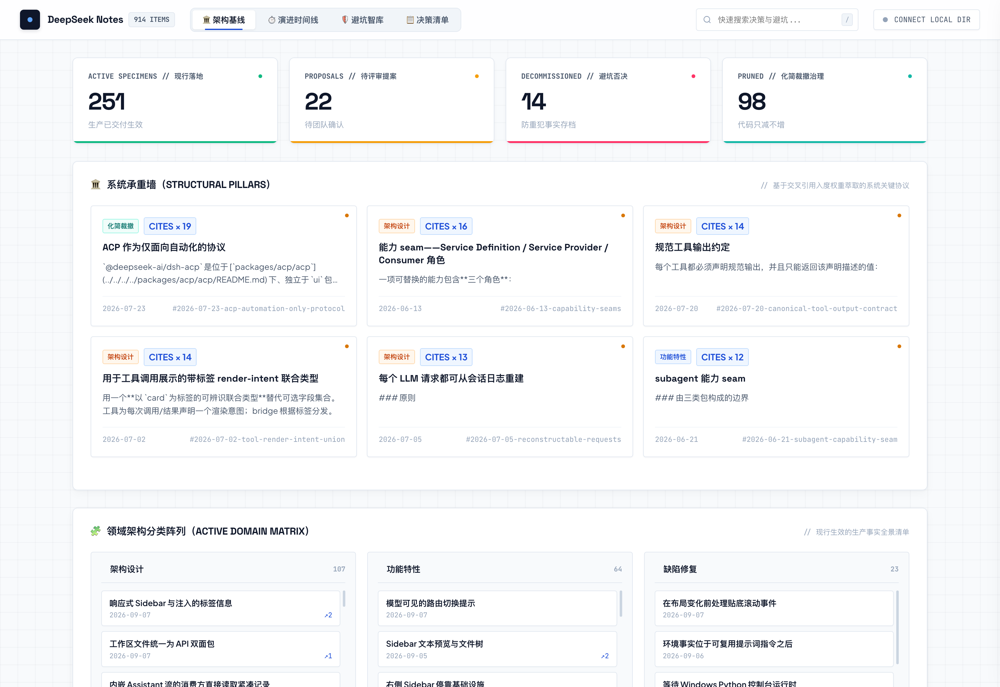

# write-notes-like-deepseek

> **像 DeepSeek 团队一样沉淀 Agent Notes**：为代码库建立面向 AI Agent 的「架构决策治理与防撞护栏」。每一次重要变更，将「为什么做」与「放弃了什么」同代码原子提交，终结 Agent 跨会话失忆与破坏性重构。

[](https://agentskills.io)
[](https://czm15053.github.io/write-notes-like-deepseek-demo/)
[](LICENSE)

<p align="center">
  
</p>

[DeepSeek Harness](https://github.com/deepseek-ai/deepseek-harness) 在两个月内演进了 1,900+ 篇 Notes。其核心不是写事后总结，而是**将代码无法承载的「为什么」与「放弃了什么」固化为仓库活资产**。

本项目把这套实践拆成开箱即用的 4 件套：Agent Skill、填空模板、CI 门禁、单文件看板。

📺 先看效果：[在线演示看板](https://czm15053.github.io/write-notes-like-deepseek-demo/)（内置 973 篇 DSH 真实决策笔记，可脱机浏览）

```bash
npx skills add czm15053/write-notes-like-deepseek
```

---

## 为什么 Agent 时代必须这么做？

<p align="center">
  
</p>

在纯人工开发时代，我们写 Wiki、写 ADR（架构决策记录），最后大多变成**代码已重构、文档未更新**的陈年摆设。

而在 **AI Agent 密集编码**时代，这个问题会引发致命故障：

1. **Agent 的跨会话失忆（Stateless Amnesia）**：每个新 Agent 会话都是一张白纸，它只能看到当前代码（What）。面对复杂的妥协设计，Agent 很容易自作聪明地用直觉方案进行“破坏性重构”。
2. **反复踩进同一个坑（Bikeshedding）**：缺乏被否决方案的显式记录，Agent 会一次次重新提议那些早在三个月前就被证明会导致死锁或内存溢出的错误路线。
3. **推导残余污染代码库（CoT Slop）**：Agent 写的文档经常充斥会话痕迹（“经讨论…”、“后续 PR 将…”），缺乏工程可验证性。

**Agent Notes 的角色，就是给未来的 Agent 树立的「防撞护栏」**：
通过入口处的一行注释（`// Note: 见 .agents/notes/...`），强制接手代码的 Agent 先读决策边界再动手。

---

## 交付了什么

<p align="center">
  
</p>

1. **Agent Skill**：装进 Cursor / Claude Code，动手前先看封条，改老代码时原地改笔记。
2. **填空模板**：`proposed` / `implemented` / `rejected`，一篇约 200 字、4 个空。
3. **CI 脚本**：校验目录、时态、备选方案和死链；方案被取代时一键归档。
4. **单文件看板**：双击 HTML 就能看承重墙、避坑智库和演进时间线。

---

## 五大核心工程纪律

| 维度 | 传统文档 / ADR | DeepSeek 体系的 Agent Note |
|---|---|---|
| **更新时序** | 事后补写或独立立项，容易滞后 | **决策与代码原子提交**，同一 Commit/PR 生效 |
| **时态与维护** | 归档后即冻结，随代码演进腐烂 | **现行法律（Living Law）**：代码改名/移路径，Note 同步就地修改 |
| **备选方案** | 选填，或仅罗列名字 | **强制反稻草人（Anti-Strawman）**：必须先写对手最强论据再否定，必含「不做/复用」 |
| **目录机制** | 依赖全局 `INDEX.md` 索引 | **路径即状态，无中心索引**：根除多 PR 并行时的 Git Merge 冲突 |
| **质量保障** | 人工自觉，无约束 | **机械门禁 + 语义自检**：CI 强校验骨架时态，去 CoT 思维链残留 |

---

## 一篇标准 Note 的形态

路径：`.agents/notes/implemented/feature/2026-08-23-sqlite-session-store.md`

```markdown
# Agent Note: 为什么用 SQLite 代替 JSONL 存储会话

Status: implemented

## Problem

现有 JSONL 存储在多进程并发写入时极易锁冲突，且按时间倒序扫描导致端到端延迟常态化突破 800ms。该问题无法通过应用层内存缓存彻底解决，崩溃时存在丢数据风险。

## Decision

会话存储改用 SQLite。启用 WAL 模式保证读写并发，核心表建立 `session_id + timestamp` 联合索引。关键入口由 `StorageEngine` 接口统一定义。

## Alternatives considered

- **维持 JSONL + 内存倒排索引**：改动成本最低。但异常断电与进程被杀时存在索引与数据文件撕裂风险，且跨进程共享内存机制过于脆弱。
- **引入外部 PostgreSQL**：查询生态成熟。但本系统为本地 CLI 工具，强制用户安装外部守护进程严重破坏了零配置开箱体验。
- **不做任何优化（仅截断历史会话）**：无法解决并发锁死问题，且破坏了长会话追溯的核心需求。

## Consequences

- **收益**：多进程读写不再争抢，历史记录定位延迟降至 10ms 以内（实测 P99 < 15ms）。
- **代价与上限**：引入了 native C 绑定，跨平台发布包体积增加约 15MB；单库并发写上限受限于 SQLite 串行写入锁，若未来单节点写 QPS > 500 需重访。
```

> **禁令规则**：在 `implemented` 状态下，CI 门禁会自动拦截任何 `## Proposal`、`## Plan`、`## Acceptance criteria` 等未来时提案口吻，只允许以现在时描述已落地的客观事实。

<p align="center">
  
</p>

---

## 目录结构与状态机

<p align="center">
  
</p>

路径格式严格遵循：`{生命周期}/{类别}/yyyy-mm-dd-主题.md`

```
.agents/notes/
├── proposed/       # 动手前：写清背景、备选方案与验收标准，经评审后施工
├── implemented/    # 施工完：改用现在时描述已落地事实，随代码原子合入
├── rejected/       # 被否决：方案被拒时冻结在此，必须写清原因，防止后人重新翻案
└── archived/       # 已归档：功能已完全落地且未来指导价值较低的记录，永久冻结
```

### 6 大封闭类别（Class）

<p align="center">
  
</p>

分类经由 TS 脚本机械拦截，严禁私自扩充：

- `feature`：用户或下游 Agent 可见的外部能力与非显然产品选择。
- `bug-fix`：缺陷修复，或复盘事故（Postmortem）补上的架构缺口。
- `architecture`：交付源码的结构性决策、模块边界、包依赖关系。
- `process`：围着代码转的工具链、门禁、构建发布规范（非运行时行为）。
- `testing`：测试基建、测试分层与验收策略。
- `simplification`：**只删不增**。清理废弃逻辑、收敛对外暴露面。（注：行为不变的普通重构归此类，不单独设 `refactor`）。

---

## 什么时候需要写？

<p align="center">
  
</p>

黄金判据：**半年后回来看这段代码，如果产生「为什么不直接用更简单的方案」的疑问，就必须写。**

---

## 真实任务流闭环

<p align="center">
  
</p>

---

## 快速上手

### 1. 安装 Skill

```bash
npx skills add czm15053/write-notes-like-deepseek
```

<p align="center">
  
</p>

### 2. 绑定到 Agent 行为规范

将以下规则加入项目根目录的 `AGENTS.md` 或 `CLAUDE.md`，约束 AI 自动遵守：

```markdown
## 架构决策留痕规范

在进行任何非平凡变更（行为、架构、协议、跨模块约定、测试策略）前：
1. 必须遵循 [write-notes-like-deepseek](.agents/skills/write-notes-like-deepseek/SKILL.md)。
2. 有新构想先立 `proposed/`；落地时随同一次代码提交转为 `implemented/`。
3. 必须包含 `## Alternatives considered`，且必须包含「不做/复用」选项与对手最强论据。
4. 代码核心入口处保留反向追溯注释：`// Note: <理由> — 见 .agents/notes/...`。
```

### 3. 本地与 CI 门禁检查

> **提示**：校验脚本依赖 `Node.js >= 18`。在宿主项目中，您可以直接让 Agent 执行校验，或将 `scripts/` 目录拷贝至项目根目录接入 CI。

```bash
# 1. 校验文件树规范与内部相对 Markdown 链接有效性
npx tsx scripts/verify-agent-note-tree.ts

# 2. 校验文件内部格式（头块三行、时态骨架、必选备选方案、禁用提案词）
npx tsx scripts/verify-agent-note-format.ts

# 3. 归档已完全落地的决策并封印入 manifest.json（自动检测入站死链）
npx tsx scripts/archive-agent-note.ts .agents/notes/implemented/<class>/<filename>.md
```

配置进 `package.json` 与 CI 流水线：

```json
{
  "scripts": {
    "verify-notes": "npx tsx scripts/verify-agent-note-tree.ts && npx tsx scripts/verify-agent-note-format.ts",
    "archive-note": "npx tsx scripts/archive-agent-note.ts",
    "board": "npx tsx scripts/build-board.ts --init board.html '工程决策看板'"
  }
}
```

### 4. 通用决策全景看板 (Agent Notes Board)

无需搭建任何后端服务或数据库，默认生成为 `board.html`（避免与业务项目现有的 `index.html` 产生任何命名冲突）：

```bash
npm run board
# 或：npx tsx scripts/build-board.ts --init board.html "项目工程看板"
```

<p align="center">
  
</p>

- **🏛️ 架构基线**：自动基于入度计算系统承重墙（Core Pillars）、按分类聚合活跃领域事实。
- **🛡️ 避坑智库**：一键聚合全库所有被否决的备选方案，排雷禁区一览无余。
- **⏱️ 演进时间线**：按月与按大类自由切片的时间里程碑流，附带精确日期标牌。
- **⚡ 本地无感热更新**：点击右上角「连接本地目录」授权后，在编辑器修改/新建 Note，切回浏览器即时自动刷新！
- **🔍 真实即时搜索**：键盘按 `/` 随时呼出命令面板，支持 `↑` `↓` 移动与回车直达抽屉。

---

## 资产库导览

本项目不仅提供模板，还完整萃取了 DeepSeek 内部的高质量文档约束：

- [`SKILL.md`](SKILL.md)：Agent 执行的主流程契约。
- [`templates/`](templates/)：`proposed`、`implemented`、`rejected` 极简规范模板。
- [`references/quality-gate.md`](references/quality-gate.md)：**语义自检清单**。指导 Agent 审查动机独立性、反稻草人备选、已知代价上限、可验证实测基线。
- [`references/prose-checklist.md`](references/prose-checklist.md)：**行文与去思维链泄露（Anti-CoT）规范**。剔除会话残余、死引用与过程叙事，确保 HEAD 视角独立可验证。
- [`references/archiving.md`](references/archiving.md)：状态机流转、决策完全取代合并规则与冻结归档机制。
- [`references/classification.md`](references/classification.md)：6 种 Class 的精确判定边界与常见困惑裁决。

---

## 参考与致敬

- 源自 [deepseek-ai/deepseek-harness](https://github.com/deepseek-ai/deepseek-harness) 的 `.agents/notes/` 架构与验证门禁体系
- 遵循 [Agent Skills](https://agentskills.io) 开放标准

## 友情链接

- [LinuxDo](https://linux.do) — 真诚、友善、团结、专业，你的品质开源与技术社区

## 许可证

[MIT](LICENSE)
